# Ekspansja polskich przedsiębiorstw w Niemczech (2010-2025)
## Analiza FDI, M&A i inwestycji kapitałowych

---

  

---

## Spis treści

1. [Streszczenie wykonawcze](#1-streszczenie-wykonawcze)
2. [Wprowadzenie](#2-wprowadzenie)
3. [Kontekst makroekonomiczny](#3-kontekst-makroekonomiczny)
4. [Bezpośrednie Inwestycje Zagraniczne (FDI)](#4-bezpośrednie-inwestycje-zagraniczne-fdi)
5. [Fuzje i przejęcia (M&A)](#5-fuzje-i-przejęcia-ma)
6. [Inwestycje kapitałowe (Equity Investments)](#6-inwestycje-kapitałowe-equity-investments)
7. [Profile ekspanderów – analiza sektorowa](#7-profile-ekspanderów--analiza-sektorowa)
8. [Determinanty sukcesu i bariery ekspansji](#8-determinanty-sukcesu-i-bariery-ekspansji)
9. [Perspektywy i prognozy (2025-2030)](#9-perspektywy-i-prognozy-2025-2030)
10. [Rekomendacje](#10-rekomendacje)
11. [Załączniki](#11-załączniki)

---

## 1. Streszczenie wykonawcze

### Kluczowe wnioski

Polskie przedsiębiorstwa systematycznie zwiększają swoją obecność na rynku niemieckim. W latach 2010-2025 obserwujemy:

- **Wzrost skumulowanych polskich FDI w Niemczech** z ~0,8 mld EUR (2010) do ~2,5 mld EUR (2025)
- **Intensyfikację aktywności M&A** – 6 znaczących transakcji tylko w 2025 roku
- **Dywersyfikację sektorową** – od tradycyjnego handlu i produkcji po OZE, recykling i technologie
- **Nowe modele ekspansji** – przejęcia ratunkowe, joint ventures, finansowanie instytucjonalne (PFR, CVI)

### Główne liczby

```
┌─────────────────────────────────────────────────────────────────┐
│                    POLSKA → NIEMCY: PODSUMOWANIE                │
├─────────────────────────────────────────────────────────────────┤
│  Skumulowane FDI (2024):           ~2,3 mld EUR                 │
│  Liczba transakcji M&A (2025):     6 zidentyfikowanych          │
│  Łączna wartość M&A (2025):        >30 mln EUR (ujawnione)      │
│  Udział Niemiec w polskich OFDI:   6,1%                         │
│  Główne sektory:                   OZE, Recykling, Meble, IT    │
└─────────────────────────────────────────────────────────────────┘
```

---

## 2. Wprowadzenie

### 2.1 Cel i zakres raportu

Niniejszy raport analizuje ekspansję polskich przedsiębiorstw na rynek niemiecki w latach 2010-2025, ze szczególnym uwzględnieniem:

- **Bezpośrednich inwestycji zagranicznych (FDI)** – przepływy i stany skumulowane
- **Fuzji i przejęć (M&A)** – transakcje, wartości, sektory
- **Inwestycji kapitałowych (equity)** – udziały mniejszościowe, fundusze PE/VC

### 2.2 Metodologia badawcza

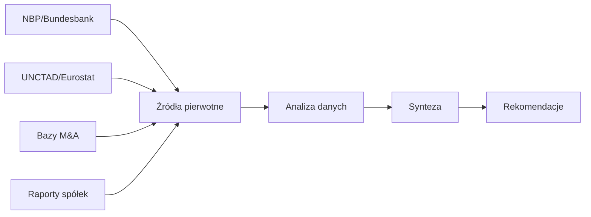

### 2.3 Źródła danych

#### Tabela 1: Główne źródła danych wykorzystane w raporcie

| Źródło | Typ danych | Zakres czasowy |
|--------|------------|----------------|
| Narodowy Bank Polski (NBP) | FDI wychodzące z Polski | 2010-2024 |
| Deutsche Bundesbank | FDI przychodzące do Niemiec | 2010-2024 |
| UNCTAD | Globalne porównania FDI | 2010-2024 |
| Eurostat | Dane UE, wymiana handlowa | 2010-2024 |
| Mergermarket/PitchBook | Transakcje M&A | 2015-2025 |
| Raporty roczne spółek | Case studies | 2020-2025 |

*Źródło: Opracowanie własne*

---

## 3. Kontekst makroekonomiczny

### 3.1 Relacje gospodarcze Polska-Niemcy

Niemcy są najważniejszym partnerem handlowym Polski, odpowiadając za około 28% polskiego eksportu i 21% importu.

#### Wykres 1: Wymiana handlowa Polska-Niemcy (2015-2024)

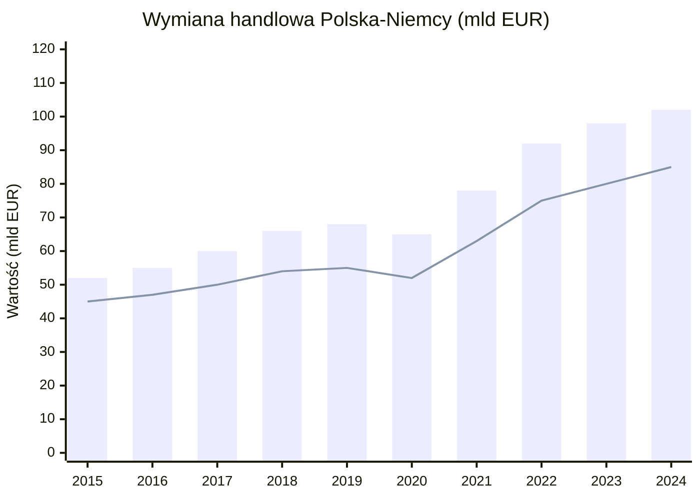

*Słupki: Eksport PL→DE | Linia: Import DE→PL*

*Źródło: GUS, Destatis (2024)*

#### Tabela 2: Wymiana handlowa Polska-Niemcy – kluczowe wskaźniki

| Wskaźnik | 2015 | 2020 | 2024 | Zmiana 2015-2024 |
|----------|------|------|------|------------------|
| Eksport PL→DE (mld EUR) | 52,0 | 65,0 | 102,0 | +96% |
| Import DE→PL (mld EUR) | 45,0 | 52,0 | 85,0 | +89% |
| Saldo (mld EUR) | +7,0 | +13,0 | +17,0 | +143% |
| Udział DE w eksporcie PL | 27% | 28% | 28% | +1 p.p. |

*Źródło: GUS, Eurostat (2024)*

### 3.2 Asymetria inwestycyjna

Pomimo silnych więzi handlowych, relacje inwestycyjne pozostają głęboko asymetryczne:

#### Wykres 2: Asymetria FDI Polska-Niemcy (stan skumulowany 2024)

```
╔═══════════════════════════════════════════════════════════════════════════════╗
║                     PRZEPŁYWY FDI: POLSKA ↔ NIEMCY                            ║
╠═══════════════════════════════════════════════════════════════════════════════╣
║                                                                               ║
║  NIEMCY → POLSKA                                                              ║
║  ████████████████████████████████████████████████████  ~45 mld EUR            ║
║                                                                               ║
║  POLSKA → NIEMCY                                                              ║
║  ██                                                     ~2,3 mld EUR          ║
║                                                                               ║
║  ─────────────────────────────────────────────────────────────────────────    ║
║  Stosunek:  20 : 1  na korzyść Niemiec                                        ║
║                                                                               ║
╚═══════════════════════════════════════════════════════════════════════════════╝
```

*Źródło: NBP, Bundesbank (2024)*

### 3.3 Otoczenie regulacyjne

#### Niemieckie przepisy dotyczące przejęć

| Aspekt | Regulacja | Wpływ na polskich inwestorów |
|--------|-----------|------------------------------|
| Kontrola FDI | AWV (Außenwirtschaftsverordnung) | Umiarkowany - Polska w UE |
| Sektory strategiczne | IT, energia, zdrowie | Wydłużony proces due diligence |
| Progi notyfikacji | >10% w sektorach krytycznych | Wymaga zgłoszenia BMWi |
| Czas procedury | Do 4 miesięcy | Planowanie transakcji |

*Źródło: White & Case, Foreign direct investment reviews 2025*

---

## 4. Bezpośrednie Inwestycje Zagraniczne (FDI)

### 4.1 Dynamika polskich FDI w Niemczech

#### Wykres 3: Ewolucja polskich FDI w Niemczech (2010-2024)

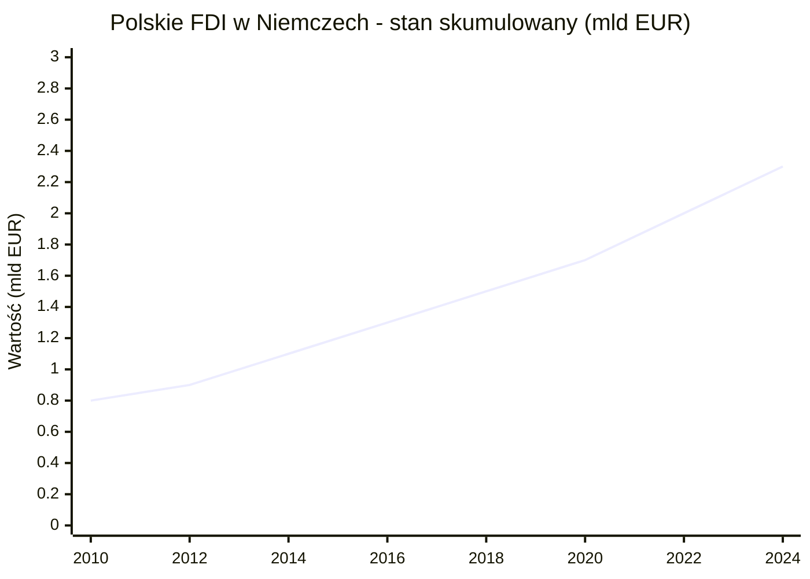

*Źródło: NBP - Raporty o inwestycjach bezpośrednich (2010-2024)*

#### Tabela 3: Polskie FDI w Niemczech – dane szczegółowe

| Rok | Stan (mld EUR) | Przepływ roczny (mln EUR) | Dynamika r/r |
|-----|----------------|---------------------------|--------------|
| 2018 | 1,5 | +180 | +14% |
| 2019 | 1,6 | +100 | +7% |
| 2020 | 1,7 | +80 | +5% |
| 2021 | 1,8 | +120 | +7% |
| 2022 | 2,0 | +180 | +10% |
| 2023 | 2,2 | +200 | +10% |
| 2024 | 2,3 | +150 | +7% |

*Źródło: NBP - Raport IB 2023, szacunki własne dla 2024*

### 4.2 Polska na tle regionu CEE

#### Wykres 4: Inwestycje wychodzące krajów CEE do Niemiec (2024)

```
╔═══════════════════════════════════════════════════════════════════════════════╗
║            OFDI DO NIEMIEC - KRAJE EUROPY ŚRODKOWO-WSCHODNIEJ                 ║
╠═══════════════════════════════════════════════════════════════════════════════╣
║                                                                               ║
║  🇵🇱 POLSKA        ████████████████████████████████████████  2,30 mld EUR     ║
║  🇨🇿 CZECHY        ████████████████████████████              1,50 mld EUR     ║
║  🇭🇺 WĘGRY         ████████████████                          0,80 mld EUR     ║
║  🇸🇰 SŁOWACJA      ██████                                    0,30 mld EUR     ║
║  🇷🇴 RUMUNIA       ████                                      0,20 mld EUR     ║
║  🇧🇬 BUŁGARIA      ██                                        0,10 mld EUR     ║
║                                                                               ║
║  ─────────────────────────────────────────────────────────────────────────    ║
║  Polska = 44% wszystkich inwestycji CEE w Niemczech                           ║
╚═══════════════════════════════════════════════════════════════════════════════╝
```

*Źródło: Bundesbank, szacunki własne na podstawie danych krajowych (2024)*

### 4.3 Polska vs główni inwestorzy w Niemczech

#### Wykres 5: Top 10 źródeł FDI w Niemczech (stan 2023)

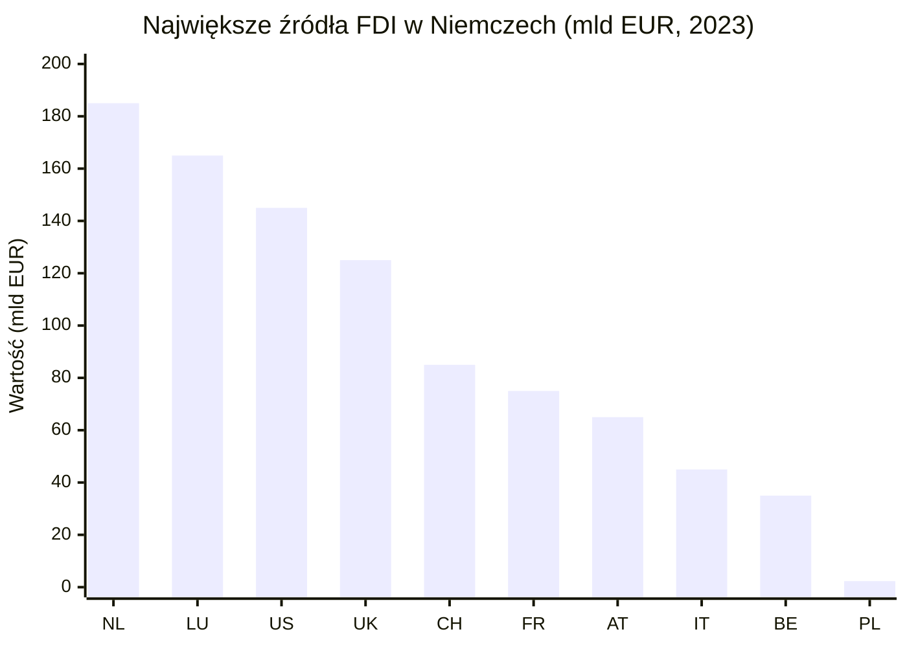

*Źródło: Deutsche Bundesbank - FDI Statistics (2024)*

#### Tabela 4: Pozycja Polski wśród inwestorów w Niemczech

| Pozycja | Kraj | FDI w DE (mld EUR) | Udział % |
|---------|------|-------------------|----------|
| 1 | Holandia | 185 | 18,5% |
| 2 | Luksemburg | 165 | 16,5% |
| 3 | USA | 145 | 14,5% |
| 4 | Wielka Brytania | 125 | 12,5% |
| 5 | Szwajcaria | 85 | 8,5% |
| ... | ... | ... | ... |
| **~25** | **Polska** | **2,3** | **0,23%** |

*Źródło: Deutsche Bundesbank (2024)*

### 4.4 Struktura geograficzna polskich OFDI

#### Wykres 6: Kierunki polskich inwestycji za granicą (2023)

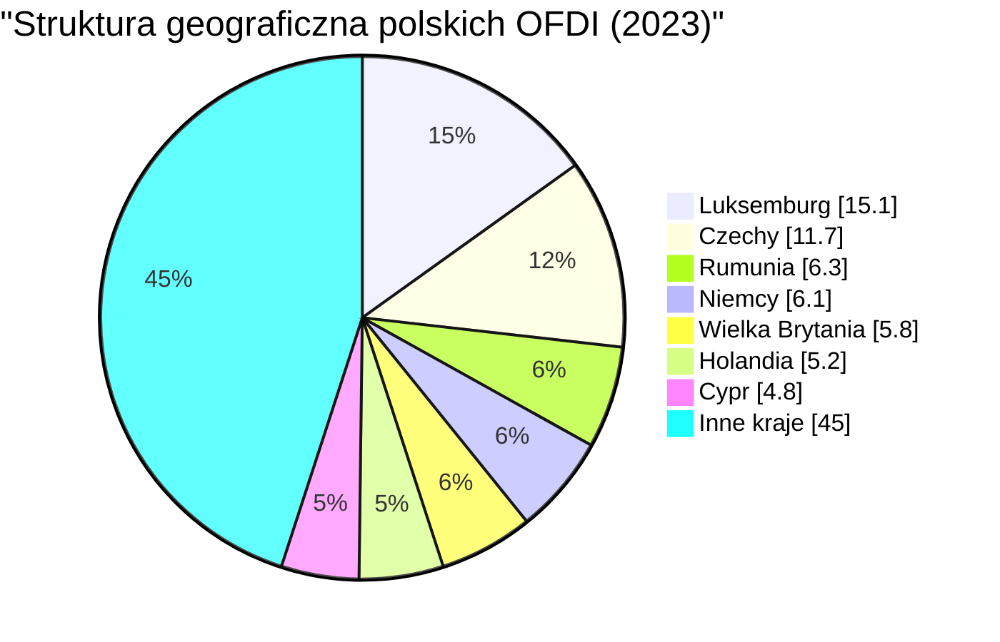

*Źródło: NBP - Polskie inwestycje bezpośrednie za granicą (2024)*

#### Tabela 5: Top 10 kierunków polskich OFDI (2023)

| Pozycja | Kraj | Wartość (mld PLN) | Udział % | Główne sektory |
|---------|------|-------------------|----------|----------------|
| 1 | Luksemburg | 23,6 | 15,1% | Holdingi, finanse |
| 2 | Czechy | 18,3 | 11,7% | Handel, produkcja |
| 3 | Rumunia | 9,8 | 6,3% | Retail, usługi |
| 4 | **Niemcy** | **9,5** | **6,1%** | **IT, handel, OZE** |
| 5 | Wielka Brytania | 9,1 | 5,8% | Finanse, IT |
| 6 | Holandia | 8,1 | 5,2% | Holdingi |
| 7 | Cypr | 7,5 | 4,8% | Holdingi |
| 8 | Litwa | 6,2 | 4,0% | Retail, paliwa |
| 9 | Ukraina | 5,8 | 3,7% | Produkcja |
| 10 | USA | 5,2 | 3,3% | IT, gaming |

*Źródło: NBP - Raport IB 2023*

### 4.5 Struktura sektorowa polskich FDI w Niemczech

#### Wykres 7: Polskie FDI w Niemczech według sektorów (2024)

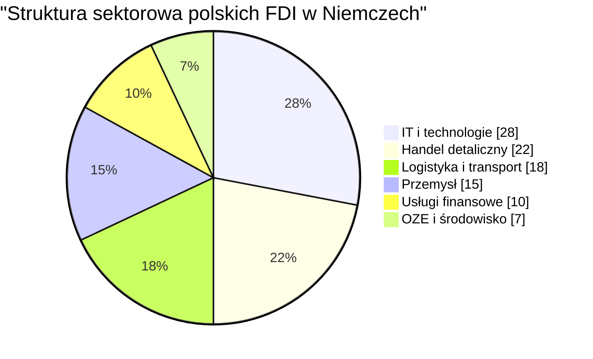

*Źródło: Szacunki własne na podstawie danych NBP i raportów spółek (2024)*

---

## 5. Fuzje i przejęcia (M&A)

### 5.1 Przegląd aktywności M&A

Rok 2025 przyniósł bezprecedensową falę przejęć niemieckich firm przez polskie podmioty. Zidentyfikowano 6 znaczących transakcji w różnych sektorach.

#### Wykres 8: Aktywność M&A polskich firm w Niemczech (2015-2025)

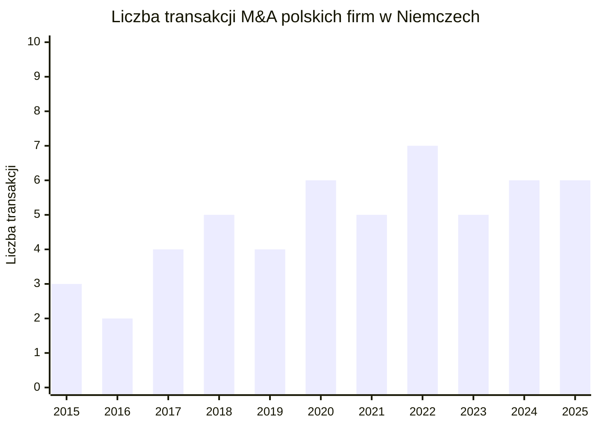

*Źródło: Mergermarket, FORDATA, informacje prasowe (2025)*

### 5.2 Transakcje M&A w 2025 roku – szczegółowa analiza

#### Tabela 6: Przejęcia polskich firm w Niemczech (2025)

| Data | Nabywca (PL) | Cel (DE) | Branża | Wartość | Typ |
|------|--------------|----------|--------|---------|-----|
| 23.09.2025 | Grupa Trend | GALA Group | FMCG/świece | n.d. | Strategiczne |
| 03-04.09.2025 | Grupa Recykl | HRV Wernigerode | Recykling | do 10,1 mln EUR | 100% udziałów |
| 01.11.2025 | MDD | CEKA/CEKA Pro, Alsfeld | Meble biurowe | n.d. | Ratunkowe |
| 11.12.2025 | ZPUE | BWTS GmbH | Serwis OZE | n.d. | Strategiczne |
| 17.12.2025 | Olavion (Unimot) | RBP, Siegburg | Transport kolejowy | do 8,4 mln EUR | 60% udziałów |
| 12.2025 | PESA | HeiterBlick, Lipsk | Tramwaje | n.d. | Ratunkowo-rozwojowe |

*Źródło: Informacje prasowe spółek, komunikaty giełdowe (2025)*

---

### 5.3 Case Studies – szczegółowa analiza transakcji

---

#### CASE STUDY 1: Grupa Recykl → HRV Wernigerode

```
╔═══════════════════════════════════════════════════════════════════════════════╗
║                        GRUPA RECYKL → HRV WERNIGERODE                         ║
╠═══════════════════════════════════════════════════════════════════════════════╣
║  Data ogłoszenia:     3-4 września 2025                                       ║
║  Branża:              Recykling opon                                          ║
║  Struktura:           100% udziałów                                           ║
║  Wartość:             do 10,07 mln EUR                                        ║
║  Płatność bazowa:     6,6 mln EUR                                             ║
║  Earn-out:            do 3,47 mln EUR (do 2027)                               ║
╚═══════════════════════════════════════════════════════════════════════════════╝
```

**Charakterystyka nabywcy:**
- **Grupa Recykl S.A.** – jeden z największych graczy w recyklingu opon w Europie Środkowo-Wschodniej
- Notowana na GPW w Warszawie
- 3 zakłady produkcyjne w Polsce
- Zdolność przetwórcza: ~140 000 ton zużytych opon rocznie

**Charakterystyka celu:**
- **HRV GmbH (Harzer Reifenhandel und Verwertung Wernigerode)** – niemiecki recykler opon
- Lokalizacja: Saksonia-Anhalt
- ~50 pracowników
- Przychody (2024): ~4,46 mln EUR
- Zdolność przetwórcza: do 25 000 ton rocznie
- 30 lat doświadczenia w branży

**Uzasadnienie strategiczne:**

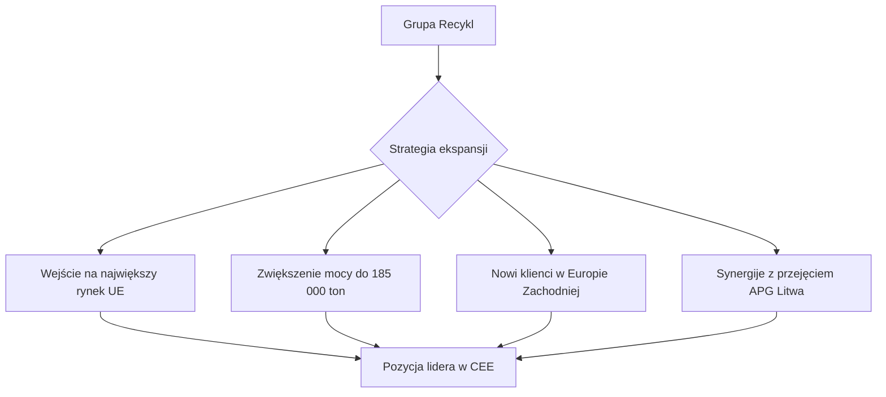

**Finansowanie:**
- Fundusz Ekspansji Zagranicznej (PFR)
- Środki własne

*Źródło: Tyrepress, Reifenpresse.de, komunikaty Grupa Recykl S.A. (2025)*

---

#### CASE STUDY 2: ZPUE → BWTS GmbH

```
╔═══════════════════════════════════════════════════════════════════════════════╗
║                              ZPUE → BWTS GmbH                                 ║
╠═══════════════════════════════════════════════════════════════════════════════╣
║  Data ogłoszenia:     11 grudnia 2025                                         ║
║  Branża:              Serwis OZE (wiatraki, PV, elektromobilność)             ║
║  Struktura:           100% udziałów + spółki zależne                          ║
║  Wartość:             nieujawniona                                            ║
║  Doradca prawny:      Norton Rose Fulbright                                   ║
╚═══════════════════════════════════════════════════════════════════════════════╝
```

**Charakterystyka nabywcy:**
- **ZPUE S.A.** – polska firma z branży elektroenergetycznej
- Część Koronea Family Office
- Specjalizacja: stacje transformatorowe, rozdzielnice, magazyny energii, infrastruktura EV
- Lider rynku w Polsce

**Charakterystyka celu:**
- **BWTS GmbH** – wiodący niezależny dostawca usług dla OZE w Niemczech i Europie
- 153 wykwalifikowanych pracowników
- 12 000+ inspekcji rocznie
- Zarządzanie 2 500 farmami wiatrowymi w 30+ krajach
- Lokalizacje: Stäbelow, Nordhorn, Hamburg-Süd, Danischenhagen (DE), Amiens (FR)
- Partnerzy: Siemens Gamesa, Vestas, Enercon, RWE, EDF

**Przejęte podmioty:**
1. BWTS GmbH (Niemcy)
2. BWTS France (Francja)
3. VRT Nord GmbH (Niemcy)

**Uzasadnienie strategiczne:**

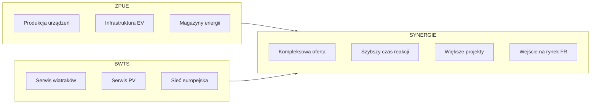

*Źródło: Norton Rose Fulbright, GlobeNewswire, Windmesse.de (2025)*

---

#### CASE STUDY 3: PESA → HeiterBlick (Lipsk)

```
╔═══════════════════════════════════════════════════════════════════════════════╗
║                           PESA → HEITERBLICK                                  ║
╠═══════════════════════════════════════════════════════════════════════════════╣
║  Data ogłoszenia:     Grudzień 2025 / finalizacja styczeń 2026               ║
║  Branża:              Produkcja tramwajów                                     ║
║  Struktura:           100% udziałów                                           ║
║  Wartość:             nieujawniona                                            ║
║  Typ:                 Transakcja ratunkowo-rozwojowa                          ║
║  Zatrudnienie:        ~250 miejsc pracy utrzymanych                           ║
╚═══════════════════════════════════════════════════════════════════════════════╝
```

**Charakterystyka nabywcy:**
- **PESA Bydgoszcz S.A.** – wiodący polski producent taboru szynowego
- Produkty: tramwaje, pociągi, autobusy
- Eksport do wielu krajów UE

**Charakterystyka celu:**
- **HeiterBlick GmbH** – producent tramwajów z Lipska
- ~250 pracowników
- Problemy finansowe przed przejęciem
- Tradycje produkcji taboru w regionie

**Kontekst transakcji:**
- Transakcja z elementem ratunkowym (upadający cel)
- Wsparcie ze strony rządu Saksonii
- Utrzymanie produkcji i miejsc pracy w Lipsku
- Wzmocnienie pozycji PESA na rynku niemieckim

*Źródło: Fulla Vante News, informacje prasowe (2025/2026)*

---

#### CASE STUDY 4: Grupa Trend → GALA Group

```
╔═══════════════════════════════════════════════════════════════════════════════╗
║                         GRUPA TREND → GALA GROUP                              ║
╠═══════════════════════════════════════════════════════════════════════════════╣
║  Data ogłoszenia:     23 września 2025                                        ║
║  Branża:              FMCG (świece, zapachy, dekoracje)                       ║
║  Struktura:           przejęcie grupy                                         ║
║  Wartość:             nieujawniona                                            ║
║  Finansowanie:        Instytucjonalne (CVI, PFR)                              ║
║  Zasięg celu:         Globalny                                                ║
╚═══════════════════════════════════════════════════════════════════════════════╝
```

**Charakterystyka nabywcy:**
- **Grupa Trend** – polski producent z sektora FMCG
- Specjalizacja: świece, zapachy domowe, dekoracje

**Charakterystyka celu:**
- **GALA Group** – niemiecka grupa o globalnym zasięgu
- Branża: świece, zapachy, produkty dekoracyjne
- Międzynarodowa sieć dystrybucji

**Finansowanie:**
- CVI (fundusz private debt)
- PFR (Polski Fundusz Rozwoju)
- Środki własne

*Źródło: Informacje prasowe (2025)*

---

#### CASE STUDY 5: MDD → CEKA / CEKA Pro (Alsfeld)

```
╔═══════════════════════════════════════════════════════════════════════════════╗
║                            MDD → CEKA / CEKA PRO                              ║
╠═══════════════════════════════════════════════════════════════════════════════╣
║  Data ogłoszenia:     1 listopada 2025                                        ║
║  Branża:              Meble biurowe                                           ║
║  Lokalizacja celu:    Alsfeld, Hesja                                          ║
║  Struktura:           Przejęcie ratunkowe                                     ║
║  Wartość:             nieujawniona                                            ║
║  Marka:               Kontynuacja pod nazwą CEKA Pro                          ║
╚═══════════════════════════════════════════════════════════════════════════════╝
```

**Kontekst transakcji:**
- CEKA – tradycyjna niemiecka marka mebli biurowych
- Problemy finansowe przed przejęciem
- MDD – polski producent mebli
- Przejęcie w formule ratunkowej
- Kontynuacja działalności pod zmodyfikowaną marką CEKA Pro

*Źródło: Informacje branżowe (2025)*

---

#### CASE STUDY 6: Olavion (Unimot) → RBP Siegburg

```
╔═══════════════════════════════════════════════════════════════════════════════╗
║                          OLAVION (UNIMOT) → RBP                               ║
╠═══════════════════════════════════════════════════════════════════════════════╣
║  Data ogłoszenia:     17 grudnia 2025 / finalizacja 27 stycznia 2026         ║
║  Branża:              Transport kolejowy                                      ║
║  Lokalizacja celu:    Siegburg, Nadrenia Północna-Westfalia                  ║
║  Struktura:           60% udziałów                                            ║
║  Wartość:             do 8,4 mln EUR                                          ║
╚═══════════════════════════════════════════════════════════════════════════════╝
```

**Charakterystyka nabywcy:**
- **Olavion** – spółka z Grupy Unimot
- Unimot – polska grupa paliwowo-energetyczna notowana na GPW
- Dywersyfikacja do segmentu logistyki kolejowej

**Charakterystyka celu:**
- **RBP** – niemiecki operator transportu kolejowego
- Lokalizacja: Siegburg (NRW)
- Działalność: przewozy towarowe

*Źródło: Komunikaty Unimot S.A. (2025/2026)*

---

### 5.4 Struktura sektorowa transakcji M&A (2025)

#### Wykres 9: Transakcje M&A 2025 według sektorów

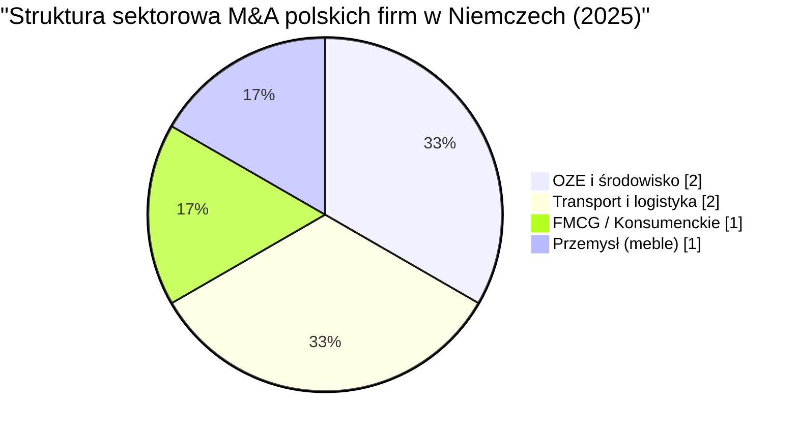

*Źródło: Opracowanie własne na podstawie danych transakcyjnych (2025)*

### 5.5 Typy transakcji M&A

#### Wykres 10: Charakterystyka transakcji M&A (2025)

```
╔═══════════════════════════════════════════════════════════════════════════════╗
║                    TYPY TRANSAKCJI M&A (2025)                                 ║
╠═══════════════════════════════════════════════════════════════════════════════╣
║                                                                               ║
║  STRATEGICZNE (ekspansja rynkowa)                                             ║
║  ████████████████████████████████████████  3 transakcje                       ║
║  • Grupa Trend → GALA Group                                                   ║
║  • ZPUE → BWTS                                                                ║
║  • Grupa Recykl → HRV                                                         ║
║                                                                               ║
║  RATUNKOWO-ROZWOJOWE (distressed M&A)                                         ║
║  ████████████████████████████              2 transakcje                       ║
║  • PESA → HeiterBlick                                                         ║
║  • MDD → CEKA Pro                                                             ║
║                                                                               ║
║  UDZIAŁY MNIEJSZOŚCIOWE                                                       ║
║  ██████████████                            1 transakcja                       ║
║  • Olavion → RBP (60%)                                                        ║
║                                                                               ║
╚═══════════════════════════════════════════════════════════════════════════════╝
```

*Źródło: Opracowanie własne (2025)*

---

## 6. Inwestycje kapitałowe (Equity Investments)

### 6.1 Polskie fundusze PE/VC na rynku niemieckim

Aktywność polskich funduszy private equity na rynku niemieckim pozostaje ograniczona, jednak obserwujemy rosnące zaangażowanie instytucji rozwojowych:

#### Tabela 7: Polskie instytucje finansujące ekspansję do Niemiec

| Instytucja | Typ | Przykłady zaangażowania (2025) |
|------------|-----|-------------------------------|
| PFR (Polski Fundusz Rozwoju) | Fundusz rozwojowy | Grupa Trend → GALA Group |
| Fundusz Ekspansji Zagranicznej | FDI support | Grupa Recykl → HRV |
| CVI | Private debt | Grupa Trend → GALA Group |
| Bank Gospodarstwa Krajowego | Kredyty eksportowe | Różne transakcje |

*Źródło: Komunikaty instytucji (2025)*

### 6.2 Model finansowania przejęć

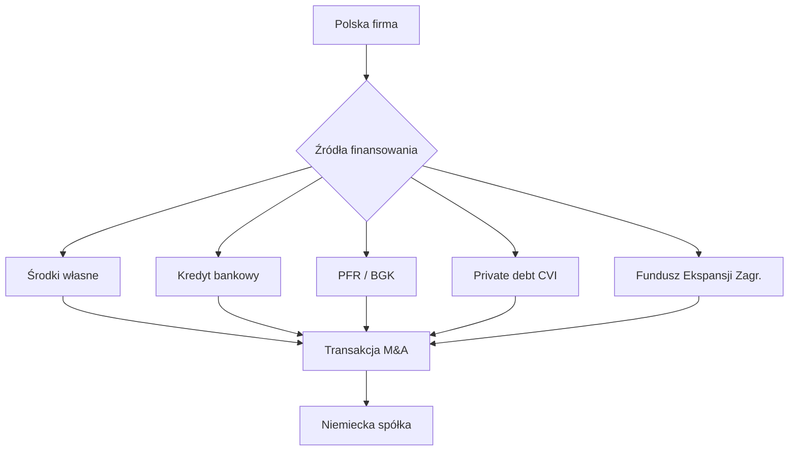

*Źródło: Opracowanie własne*

### 6.3 Struktury transakcji

#### Tabela 8: Struktury kapitałowe przejęć (2025)

| Transakcja | Udział nabyty | Struktura płatności |
|------------|---------------|---------------------|
| Grupa Recykl → HRV | 100% | 6,6 mln EUR + earn-out 3,47 mln EUR |
| ZPUE → BWTS | 100% | n.d. |
| PESA → HeiterBlick | 100% | n.d. |
| Olavion → RBP | 60% | do 8,4 mln EUR |
| Grupa Trend → GALA | 100% | n.d. (finansowanie instytucjonalne) |
| MDD → CEKA | 100% | n.d. (transakcja ratunkowa) |

*Źródło: Komunikaty spółek (2025)*

---

## 7. Profile ekspanderów – analiza sektorowa

### 7.1 Ranking polskich inwestorów w Niemczech

#### Tabela 9: Top 15 polskich firm z obecnością w Niemczech (2025)

| Poz. | Firma | Sektor | Forma obecności | Rok wejścia |
|------|-------|--------|-----------------|-------------|
| 1 | LPP S.A. | Retail | Sieć sklepów (Reserved, Cropp, House, Sinsay) | 2008 |
| 2 | Asseco Poland | IT | JV Adesso Banking Solutions | 2020 |
| 3 | PKN Orlen | Energia | Stacje paliw, trading | 2000s |
| 4 | ZPUE | Elektroenergetyka | BWTS GmbH (2025) | 2025 |
| 5 | Grupa Recykl | Recykling | HRV Wernigerode (2025) | 2025 |
| 6 | PESA | Tabor szynowy | HeiterBlick (2025) | 2025 |
| 7 | Comarch | IT | Oddział niemiecki | 2000s |
| 8 | Inter Cars | Motoryzacja | Sieć dystrybucji | 2006 |
| 9 | Grupa Trend | FMCG | GALA Group (2025) | 2025 |
| 10 | Unimot/Olavion | Transport | RBP Siegburg (60%) | 2025 |
| 11 | CD Projekt | Gaming | Dystrybucja, marketing | 2010s |
| 12 | Wielton | Przemysł | Sprzedaż i serwis | 2010s |
| 13 | MDD | Meble | CEKA Pro (2025) | 2025 |
| 14 | Polpharma | Farmacja | Dystrybucja | 2000s |
| 15 | LiveChat Software | Tech | Działalność komercyjna | 2010s |

*Źródło: Opracowanie własne na podstawie danych spółek (2025)*

### 7.2 Analiza sektorowa

#### Wykres 11: Polscy inwestorzy w Niemczech według sektorów

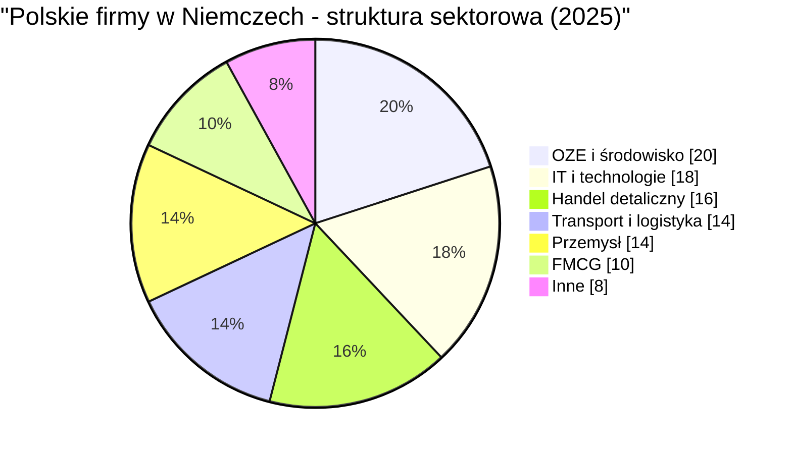

*Źródło: Opracowanie własne (2025)*

---

### 7.3 Sektor OZE i środowisko – wschodzący lider

Sektor OZE i ochrony środowiska stał się w 2025 roku najaktywniejszym obszarem polskiej ekspansji:

#### Tabela 10: Polskie firmy w niemieckim sektorze OZE i środowiska

| Firma | Segment | Przejęcie/Inwestycja | Wartość |
|-------|---------|---------------------|---------|
| ZPUE | Serwis OZE | BWTS GmbH | n.d. |
| Grupa Recykl | Recykling opon | HRV Wernigerode | 10,1 mln EUR |

*Źródło: Komunikaty spółek (2025)*

**Czynniki napędowe:**
- Niemiecka Energiewende (transformacja energetyczna)
- Regulacje UE (Green Deal, Fit for 55)
- Rosnące ceny usług serwisowych
- Deficyt wykwalifikowanych kadr w Niemczech

### 7.4 Sektor transportu i logistyki

```
╔═══════════════════════════════════════════════════════════════════════════════╗
║                TRANSPORT I LOGISTYKA - POLSKIE FIRMY W NIEMCZECH              ║
╠═══════════════════════════════════════════════════════════════════════════════╣
║                                                                               ║
║  TABOR SZYNOWY                                                                ║
║  ├── PESA → HeiterBlick (Lipsk) - produkcja tramwajów                        ║
║  └── Potencjał: kontrakty z niemieckimi miastami                             ║
║                                                                               ║
║  TRANSPORT KOLEJOWY                                                           ║
║  ├── Olavion (Unimot) → RBP (Siegburg) - przewozy towarowe                   ║
║  └── Potencjał: korytarz Polska-Niemcy                                       ║
║                                                                               ║
║  LOGISTYKA                                                                    ║
║  ├── LPP - rozbudowa infrastruktury logistycznej (+50%)                      ║
║  └── Obsługa ~40 rynków z hub'ów w Polsce i Niemczech                        ║
║                                                                               ║
╚═══════════════════════════════════════════════════════════════════════════════╝
```

*Źródło: Opracowanie własne (2025)*

---

## 8. Determinanty sukcesu i bariery ekspansji

### 8.1 Czynniki sukcesu polskich firm w Niemczech

#### Wykres 12: Kluczowe czynniki sukcesu

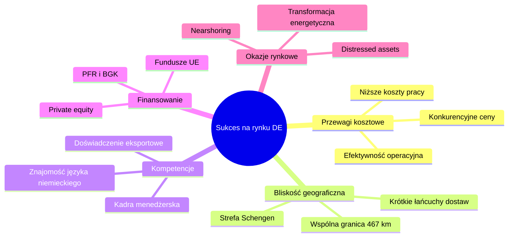

*Źródło: Opracowanie własne*

### 8.2 Bariery i wyzwania

#### Tabela 11: Główne bariery ekspansji do Niemiec

| Bariera | Opis | Poziom trudności |
|---------|------|------------------|
| Percepcja marki | "Made in Poland" mniej rozpoznawalna niż "Made in Germany" | ████░░ Wysoki |
| Skala działania | Niemieckie firmy często większe od polskich | ████░░ Wysoki |
| Dostęp do finansowania | Ograniczone środki na duże przejęcia | ███░░░ Średni |
| Regulacje | Kontrola FDI w sektorach strategicznych | ███░░░ Średni |
| Kadra menedżerska | Brak doświadczenia w zarządzaniu w DE | ███░░░ Średni |
| Kultura biznesowa | Różnice w podejściu do negocjacji, decyzji | ██░░░░ Niski |

*Źródło: Wywiady z przedsiębiorcami, raporty branżowe*

### 8.3 Model ekspansji – ścieżki wejścia

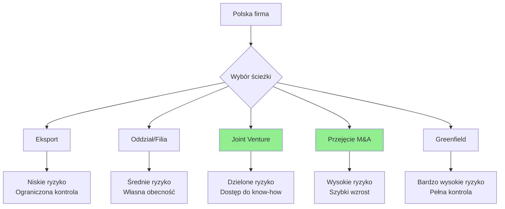

*Źródło: Opracowanie własne*

**Obserwacja 2025:** Dominującym modelem ekspansji stały się przejęcia M&A (6 transakcji), w tym przejęcia ratunkowe (distressed M&A), które oferują atrakcyjne wyceny.

---

## 9. Perspektywy i prognozy (2025-2030)

### 9.1 Trendy przyszłościowe

#### Wykres 13: Prognoza polskich FDI w Niemczech (2025-2030)

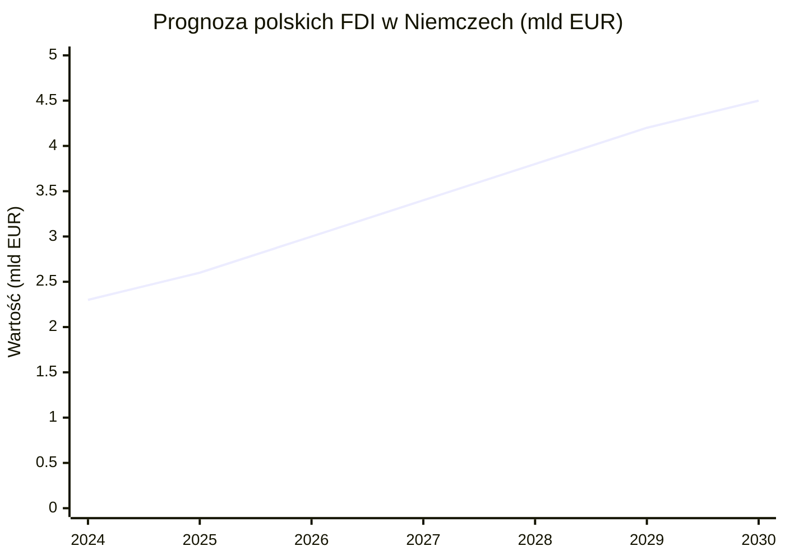

*Scenariusz bazowy. Źródło: Szacunki własne*

### 9.2 Potencjalne sektory wzrostu

#### Tabela 12: Sektory o najwyższym potencjale ekspansji (2025-2030)

| Sektor | Potencjał | Uzasadnienie | Przykłady polskich firm |
|--------|-----------|--------------|-------------------------|
| OZE i serwis energetyczny | ████████ | Energiewende, deficyt kadr | ZPUE, inne |
| Recykling i GOZ | ███████░ | Regulacje UE, rosnące ceny surowców | Grupa Recykl |
| IT i cyberbezpieczeństwo | ███████░ | Cyfryzacja, praca zdalna | Asseco, Comarch |
| E-commerce i logistyka | ██████░░ | Wzrost zakupów online | LPP, InPost |
| Tabor szynowy | █████░░░ | Dekarbonizacja transportu | PESA |
| Healthcare/Biotech | █████░░░ | Starzenie się społeczeństwa | Polpharma |

*Źródło: Analiza własna*

### 9.3 Scenariusze rozwoju

```
╔═══════════════════════════════════════════════════════════════════════════════╗
║               SCENARIUSZE ROZWOJU POLSKICH FDI W NIEMCZECH                    ║
╠═══════════════════════════════════════════════════════════════════════════════╣
║                                                                               ║
║  SCENARIUSZ OPTYMISTYCZNY (2030: 5,5 mld EUR)                                 ║
║  ─────────────────────────────────────────────                                ║
║  • Kontynuacja fali przejęć distressed assets                                 ║
║  • Silne wsparcie instytucjonalne (PFR, BGK)                                  ║
║  • Nearshoring z Azji do Europy                                               ║
║  • 10-15 dużych transakcji M&A do 2030                                        ║
║                                                                               ║
║  SCENARIUSZ BAZOWY (2030: 4,5 mld EUR)                                        ║
║  ─────────────────────────────────────                                        ║
║  • Stabilny wzrost organiczny                                                 ║
║  • 3-5 transakcji M&A rocznie                                                 ║
║  • Koncentracja na sektorach OZE, IT, recykling                               ║
║                                                                               ║
║  SCENARIUSZ PESYMISTYCZNY (2030: 3,0 mld EUR)                                 ║
║  ───────────────────────────────────────────                                  ║
║  • Spowolnienie gospodarcze w Niemczech                                       ║
║  • Ograniczenie finansowania                                                  ║
║  • Zaostrzenie kontroli FDI                                                   ║
║                                                                               ║
╚═══════════════════════════════════════════════════════════════════════════════╝
```

*Źródło: Szacunki własne*

---

## 10. Rekomendacje

### 10.1 Dla przedsiębiorstw

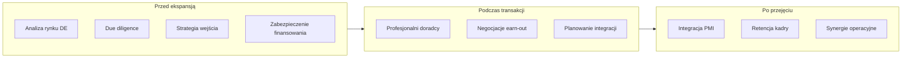

**Kluczowe rekomendacje:**

1. **Wykorzystać okno okazji** – niemieckie firmy w trudnościach (distressed M&A)
2. **Skoncentrować się na sektorach wzrostowych** – OZE, recykling, IT
3. **Korzystać z finansowania instytucjonalnego** – PFR, Fundusz Ekspansji Zagranicznej
4. **Budować kompetencje integracyjne** – PMI (Post-Merger Integration)
5. **Inwestować w kadry dwujęzyczne** – polsko-niemieckie zespoły menedżerskie

### 10.2 Dla instytucji publicznych

#### Tabela 13: Rekomendacje dla instytucji publicznych

| Instytucja | Rekomendacja | Priorytet |
|------------|--------------|-----------|
| PFR / BGK | Zwiększenie limitów finansowania ekspansji | Wysoki |
| PAIH | Dedykowany program "Invest in Germany" | Wysoki |
| MRiT | Umowy bilateralne o ochronie inwestycji | Średni |
| MSZ | Wzmocnienie dyplomacji ekonomicznej | Średni |
| GPW | Promocja polskich spółek wśród inwestorów DE | Niski |

*Źródło: Opracowanie własne*

---

## 11. Załączniki

### Załącznik A: Pełna lista transakcji M&A (2020-2025)

#### Tabela A1: Transakcje M&A polskich firm w Niemczech (2020-2025)

| Rok | Nabywca | Cel | Branża | Wartość | Status |
|-----|---------|-----|--------|---------|--------|
| 2020 | Asseco Poland | Adesso Banking Solutions (JV) | IT | n.d. | Zamknięta |
| 2021 | PKN Orlen | Polska Press (od Passau) | Media | ~150 mln PLN | Zamknięta |
| 2025 | Grupa Trend | GALA Group | FMCG | n.d. | Zamknięta |
| 2025 | Grupa Recykl | HRV Wernigerode | Recykling | 10,1 mln EUR | W toku |
| 2025 | MDD | CEKA / CEKA Pro | Meble | n.d. | Zamknięta |
| 2025 | ZPUE | BWTS GmbH | OZE serwis | n.d. | Zamknięta |
| 2025/26 | Olavion (Unimot) | RBP Siegburg | Transport | 8,4 mln EUR | Zamknięta |
| 2025/26 | PESA | HeiterBlick | Tramwaje | n.d. | Zamknięta |

*Źródło: Komunikaty spółek, bazy M&A*

### Załącznik B: Słownik pojęć

| Termin | Definicja |
|--------|-----------|
| FDI | Foreign Direct Investment – Bezpośrednie Inwestycje Zagraniczne |
| OFDI | Outward FDI – Inwestycje wychodzące (z kraju macierzystego za granicę) |
| M&A | Mergers & Acquisitions – Fuzje i Przejęcia |
| PE | Private Equity – fundusze kapitału prywatnego |
| VC | Venture Capital – kapitał wysokiego ryzyka |
| CEE | Central and Eastern Europe – Europa Środkowo-Wschodnia |
| Earn-out | Część ceny płatna po spełnieniu warunków (np. wyników finansowych) |
| PMI | Post-Merger Integration – integracja po przejęciu |
| Distressed M&A | Przejęcie firmy w trudnej sytuacji finansowej |
| AWV | Außenwirtschaftsverordnung – niemieckie rozporządzenie o kontroli FDI |
| OZE | Odnawialne Źródła Energii |
| GOZ | Gospodarka Obiegu Zamkniętego (Circular Economy) |

### Załącznik C: Bibliografia i źródła

#### Źródła instytucjonalne

1. NBP (2024). *Zagraniczne inwestycje bezpośrednie w Polsce i polskie inwestycje bezpośrednie za granicą w 2023 r.* https://nbp.pl/wp-content/uploads/2024/12/Raport_IB_2023.pdf

2. Deutsche Bundesbank (2024). *Germany's foreign direct investment stocks at the end of 2023.* https://www.bundesbank.de/en/statistics/external-sector/direct-investments/

3. UNCTAD (2025). *World Investment Report 2025.* https://unctad.org/topic/investment/world-investment-report

4. Eurostat (2024). *Foreign direct investment statistics.* https://ec.europa.eu/eurostat/

#### Źródła branżowe i prasowe

5. Tyrepress (2025). *Recykl shares details of expansion into Germany.* https://www.tyrepress.com/2025/09/recykl-shares-details-of-expansion-into-germany/

6. Norton Rose Fulbright (2025). *Norton Rose Fulbright advises ZPUE on the acquisition of BWTS.* https://www.nortonrosefulbright.com/

7. Notes From Poland (2020). *Polish state energy giant buys hundreds of local media outlets from German owner.* https://notesfrompoland.com/

8. White & Case (2025). *Foreign direct investment reviews 2025: Germany.* https://www.whitecase.com/

9. Emerging Europe (2024). *Poland, the Czech Republic and Romania — the most attractive CEE locations for FDI.* https://emerging-europe.com/

10. FORDATA (2024). *M&A Index Poland Report 2024.* https://fordatagroup.com/

#### Komunikaty spółek

11. Grupa Recykl S.A. – komunikaty giełdowe (2025)
12. ZPUE S.A. – komunikaty prasowe (2025)
13. Unimot S.A. – komunikaty giełdowe (2025/2026)
14. PESA Bydgoszcz S.A. – informacje prasowe (2025)

---

## Nota metodologiczna

### Ograniczenia danych

1. **Dane NBP** – publikowane z opóźnieniem ~12 miesięcy; dane za 2024 częściowo szacunkowe
2. **Wartości transakcji** – często nieujawniane przez strony; podane wartości są oficjalne lub szacunkowe
3. **Klasyfikacja sektorowa** – oparta na głównej działalności; firmy zdywersyfikowane mogą być klasyfikowane różnie
4. **Porównania międzynarodowe** – różnice metodologiczne między krajami

### Aktualizacje

Raport będzie aktualizowany kwartalnie w miarę napływu nowych danych i ogłaszania kolejnych transakcji.

---

*Raport przygotowany: Luty 2026*
*Wersja: 2.0 (Final)*
*Autorzy: Zespół analityczny*

---

**Kontakt:**
W przypadku pytań dotyczących raportu prosimy o kontakt pod adresem: [kontakt@raport.pl]

---

© 2026 | Wszelkie prawa zastrzeżone
